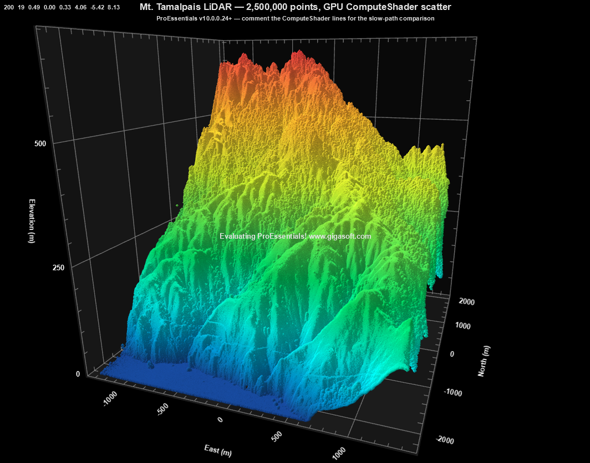

# ProEssentials WPF 3D LiDAR Scatter — ComputeShader + per-point PointColors

A ProEssentials v10 WPF .NET 8 demonstration of the v10.0.0.24 ComputeShader
path for `PolyMode = Scatter` — rendering 2.5M Mt. Tamalpais LiDAR returns
as a 3D scatter cloud with every point individually colored by elevation.

> 🚀 **The 10.0.0.24 difference is dramatic.** On this 2.5M-point dataset:
> - **10.0.0.24 (GPU ComputeShader scatter):** image appears instantly
> - **Earlier 10.x versions (CPU vertex construction):** ~3 second pause before first paint
>
> Same code, same data, same hardware — just the new GPU path engaged.
> This sample uses 10.0.0.24+ from NuGet so you get the fast path by
> default, but it will run on older versions if your local feed lags.

This is a simple project, replace with a competitor to compare.

> **Hero shot** — Mt. Tamalpais and the surrounding Marin County terrain,
> 2.5M LiDAR points colored by elevation. The summit ridge (rising to 674 m)
> reads in red/orange, foothills in green, coastal flats in cyan/teal.
>
> 

➡️ [gigasoft.com/wpf-oscilloscope-net-real-time](https://gigasoft.com/wpf-oscilloscope-net-real-time)

---

## What this WPF LiDAR demo includes

| Feature | Value |
| --- | --- |
| Chart type | `PolyMode = Scatter`, `Method = Points` |
| Vertex construction | **GPU ComputeShader** (v10.0.0.24) |
| Point count | 2,500,000 (subsampled from ~22.7M source) |
| Color strategy | **`PointColors` per data point** — every LiDAR return |
| Render engine | Direct3D |
| Coordinate convention | LiDAR XYZ → Pe3do (X, Z, Y) — elevation maps to vertical |
| Source data | NCALM 2006 Marin Headlands airborne LiDAR via OpenTopography |

Two related repos round out the LiDAR series on the same dataset:

- *(coming)* `wpf-3d-lidar-surface-proessentials` — Delaunay-triangulated surface from the same point cloud
- *(coming)* `wpf-2d-lidar-contour-proessentials` — Pesgo top-down contour view

---

## How this WPF LiDAR repo compares to other charting libraries

I looked at every major WPF charting vendor's public GitHub presence
for a LiDAR or large-scale point cloud demo:

| Vendor | Public WPF LiDAR demo | Standalone repo | Points rendered |
| --- | --- | --- | --- |
| **ProEssentials** *(this repo)* | ✅ Yes | ✅ Yes — clone & F5 | **2,500,000** raw airborne returns |
| SciChart | ✅ Yes | ❌ Sub-folder of [examples mega-repo](https://github.com/ABTSoftware/SciChart.Wpf.Examples) | ~250,000 (gridded raster) |
| LightningChart | 📝 [Blog tutorial](https://lightningchart.com/blog/lidar-chart/) only | ❌ Trial install required | Marketing claims up to 55M; no public repo to verify |
| DevExpress | ❌ None found | ❌ | — |
| Syncfusion | ❌ None found | ❌ | — |
| Telerik | ❌ None found | ❌ | — |

**Notes on the comparison.** SciChart's LiDAR example uses a 1km × 1km
gridded DEFRA raster (`tq3080_DSM_2M`, 50m elevation range) embedded as
a UserControl inside their 130+ example monorepo. LightningChart's
tutorial references a similar gridded dataset; their public collateral
claims much higher numbers but no clone-and-run repo is published to
verify them. ProEssentials' dataset here is unstructured airborne
LiDAR returns from the NCALM 2006 Marin Headlands survey, ranging from
sea level to 674m, prepared by the included `data/prepare_data.py`
from any LAZ source.

The pitch isn't *"ProEssentials is the fastest"* — that's a benchmark
fight that no vendor wins cleanly. It's *"ProEssentials is the only
WPF charting vendor that ships a focused, reproducible LiDAR repo at
this scale."* Verifiable, by definition, because you're holding it.

---

## How the GPU ComputeShader rendering path works

### ComputeShader — GPU vertex construction for scatter

Without ComputeShader, the CPU walks each of the 2.5M points sequentially on
a single core to build their vertex data. With `ComputeShader = true` the
GPU does this work — potentially 2,000+ shader cores operating in parallel.
This path was added to `PolyMode = Scatter` in v10.0.0.24.

**Measured impact on this dataset:** click-to-first-paint drops from ~3
seconds (CPU vertex construction) to essentially instant (GPU). Same code,
same data, same hardware.

Comment the four lines below to take the slow path on purpose — useful for
B-roll or before/after comparison shots:

    Pe3do1.PeData.ComputeShader  = true;
    Pe3do1.PeData.StagingBufferX = true;
    Pe3do1.PeData.StagingBufferY = true;
    Pe3do1.PeData.StagingBufferZ = true;

The staging buffers are GPU-accessible intermediate memory regions that
allow efficient CPU-to-GPU data transfer without stalling the render
pipeline during the upload.

### `PointColors` — every LiDAR return individually colored

LiDAR's signature visual is the elevation-mapped colormap. Each of the
2.5M points gets its own color sampled from a turbo-style ramp.

We build the colors as `int[]` and use `FastCopyFrom(int[])` — the
canonical bulk path — packing each element to match the `peColor32`
struct layout (`{ R, G, B, A }` bytes in declaration order, which on
little-endian gives the int form below):

    int[] packedColors = new int[nPoints];
    for (int i = 0; i < nPoints; i++)
    {
        float t = (lidarZ[i] - zMin) / zRange;       // [0, 1]
        var (r, g, b) = ElevationColorBytes(t);
        packedColors[i] = (255 << 24) | (b << 16) | (g << 8) | r;
    }
    Pe3do1.PePlot.PointColors.FastCopyFrom(packedColors);

Note this packing is **not** what `Color.ToArgb()` returns —
`ToArgb` produces `0xAARRGGBB`, but `peColor32`-as-int is `0xAABBGGRR`
(R and B swapped). Computing the packed int directly from byte values
avoids that conversion.

`PointColors[s, p]` is a 2D color array sized `Subsets x Points`. With
our single-subset layout it's `[1 x N]` — one color per LiDAR return.
When populated, `PointColors` overrides `SubsetColors` for the rendered
points (SubsetColors still drives the legend swatch).

### Single-subset layout for unstructured LiDAR

A LiDAR cloud is unstructured — there are no natural "rows." We use one
subset of N points rather than synthesizing a grid:

    Pe3do1.PeData.Subsets = 1;
    Pe3do1.PeData.Points  = nPoints;

Pre-sizing the array by touching the last cell before `FastCopyFrom` is a
recommended pattern for large datasets — it allocates the full block in
one go rather than growing incrementally.

### `SkipRanging` — don't scan 2.5M points to find min/max

The data extent is computed once at load time (we need it for the colormap
anyway). Manual axis bounds plus `SkipRanging = true` tell the engine not
to walk the data again on (re)init:

    Pe3do1.PeGrid.Configure.ManualScaleControlX = ManualScaleControl.MinMax;
    Pe3do1.PeGrid.Configure.ManualMinX = xMin - pad;
    Pe3do1.PeGrid.Configure.ManualMaxX = xMax + pad;
    // ... same for Y, Z ...
    Pe3do1.PeData.SkipRanging = true;

### LiDAR-to-Pe3do coordinate convention

Pe3do uses Y as the vertical "value" axis. LiDAR convention is Z-up. The
loader swaps:

| LiDAR axis | Pe3do axis | Meaning |
| --- | --- | --- |
| X | X | east-west (horizontal) |
| Y | Z | north-south (depth into chart) |
| Z | **Y** | elevation (vertical) |

Coordinates are pre-centered on the data centroid by the prep script — keeps
camera math well-conditioned around the origin and means UTM meters fit
comfortably in float32.

---

## LiDAR data file format

`mttam_lidar.bin` — flat little-endian binary:

    int32     nPoints
    float32 * nPoints   X (meters, east, centered)
    float32 * nPoints   Y (meters, north, centered)
    float32 * nPoints   Z (meters, elevation)

The repo ships with a 2.5M-point Mt. Tamalpais dataset already prepared
(28.6 MB). To swap in a different scene, see [`data/README.md`](data/README.md)
and run `prepare_data.py` against any LAZ tile(s) from USGS 3DEP or
OpenTopography.

The file is copied to the output directory automatically on build.

---

## Mouse and keyboard controls

| Input | Action |
| --- | --- |
| Left drag | Rotate |
| Shift + drag | Pan |
| Mouse wheel | Zoom |
| Double-click | Start/stop auto-rotation |
| Right-click | Context menu (export, view modes, color schemes) |

`DegreePrompting = true` shows live camera parameters in the top-left —
useful for finding your own preferred view and pasting the values back
into the camera defaults section of `MainWindow.xaml.cs`.

---

## Prerequisites

- Visual Studio 2022
- .NET 8 SDK
- Dedicated GPU recommended for full ComputeShader performance
- Internet connection for NuGet restore
- Python 3.9+ (only if swapping in different LAZ data — see `data/README.md`)

---

## How to run the WPF LiDAR demo

    1. Clone this repository
    2. Open MtTamalpaisLidar3D.sln in Visual Studio 2022
    3. Build → Rebuild Solution (NuGet restore is automatic)
    4. Press F5

The 2.5M-point Mt. Tamalpais dataset ships with the repo — no extra setup
required.

To swap in different data:

    pip install laspy lazrs numpy
    cd data && python prepare_data.py path/to/your_tile.laz [more_tiles.laz...]

---

## Installing the ProEssentials WPF NuGet package

References [`ProEssentials.Chart.Net80.x64.Wpf`](https://www.nuget.org/packages/ProEssentials.Chart.Net80.x64.Wpf)
v10.0.0.24 from nuget.org. The version pin allows newer patch releases
automatically. Package restore is automatic on build.

**On 10.0.0.24 or newer** the GPU ComputeShader path engages and the chart
appears instantly. **On older 10.x versions** the project still compiles
and runs correctly — vertex construction falls back to CPU and you'll see
a ~3 second pause before the first paint. Same image, same interactivity
once it's up; just slower to first frame.

A `nuget.config` next to the .sln explicitly pins the source to nuget.org
so the package resolves cleanly regardless of any local NuGet sources
configured on the cloner's machine. If you have ProEssentials installed
locally and would prefer to use the Gigasoft local feed instead (the
authors' recommended workflow for active development), delete `nuget.config`
and your machine's normal NuGet configuration will take over.

---

## LiDAR data attribution

The shipped dataset is derived from public airborne LiDAR:

- **Source:** NCALM 2006 Marin Headlands airborne LiDAR collection,
  distributed via [OpenTopography](https://portal.opentopography.org/).
- **License:** CC BY 4.0 — please cite OpenTopography and the original
  NCALM/NSF EAR data collection per the dataset metadata page.
- **Subsampled** from ~22.7M raw returns (3 LAZ tiles) down to 2.5M for
  this demo via random sampling.

For the real-data prep workflow on different scenes, USGS 3DEP data is
public domain and available via the
[USGS 3DEP LidarExplorer](https://apps.nationalmap.gov/lidar-explorer/).

---

## Related ProEssentials examples

- [WPF 3D Realtime Surface — ComputeShader + CircularBuffer](https://github.com/GigasoftInc/wpf-3d-surface-realtime-computeshader-proessentials)
- [WPF Quickstart](https://github.com/GigasoftInc/wpf-chart-quickstart-proessentials)
- [GigaPrime2D WPF — 100 Million Points](https://github.com/GigasoftInc/wpf-chart-fast-100m-points-proessentials)
- [3D Surface Height Map](https://github.com/GigasoftInc/wpf-chart-3d-surface-proessentials)
- [All Examples — GigasoftInc on GitHub](https://github.com/GigasoftInc)
- [Full Evaluation Download](https://gigasoft.com/net-chart-component-wpf-winforms-download)
- [gigasoft.com](https://gigasoft.com)

---

## License

Example code is MIT licensed. ProEssentials requires a commercial license
for continued use.

---

**Topics:** WPF · 3D charting · LiDAR · point cloud · GPU compute shader ·
ProEssentials · Direct3D · .NET 8 · scatter plot · data visualization ·
GIS · topography · airborne LiDAR · USGS 3DEP · OpenTopography
